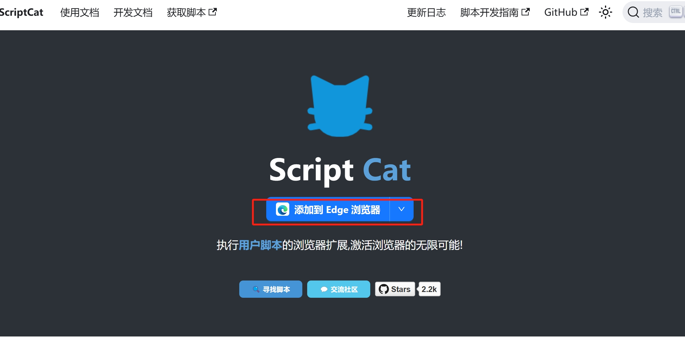
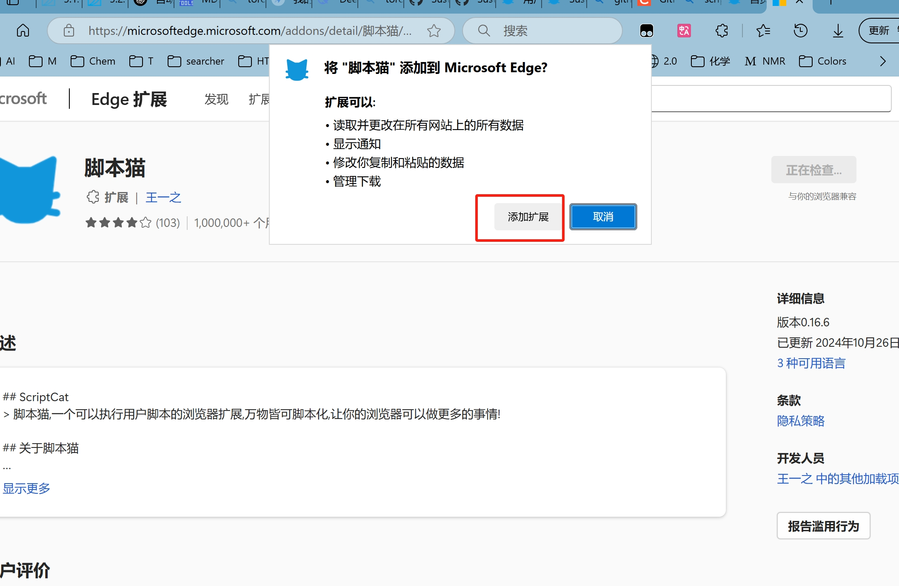
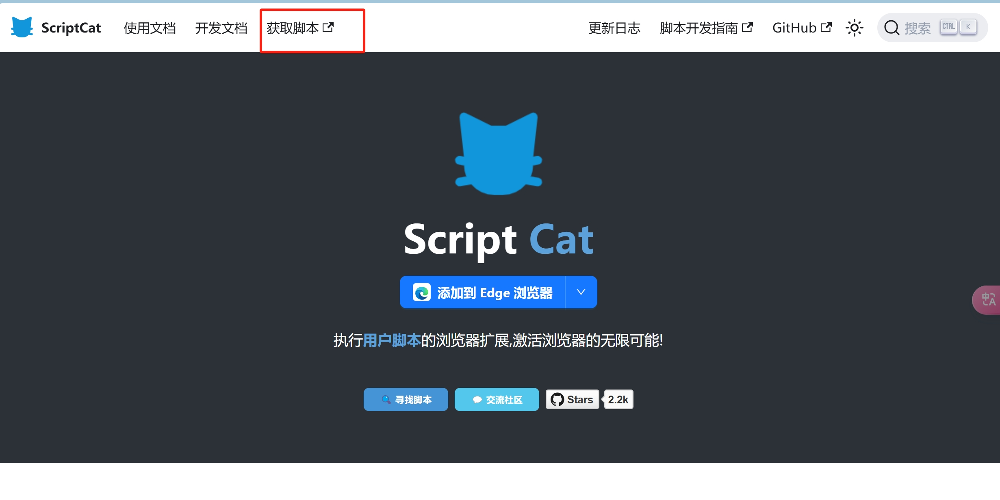
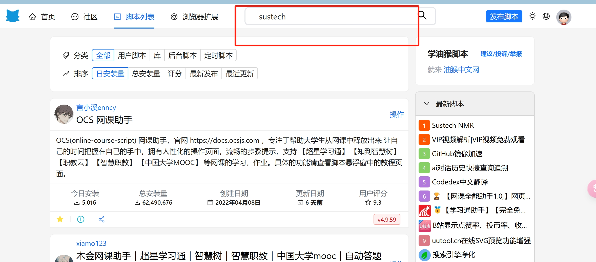
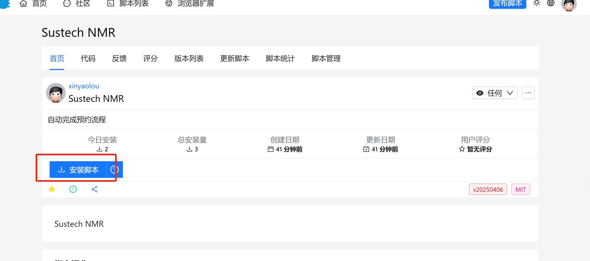
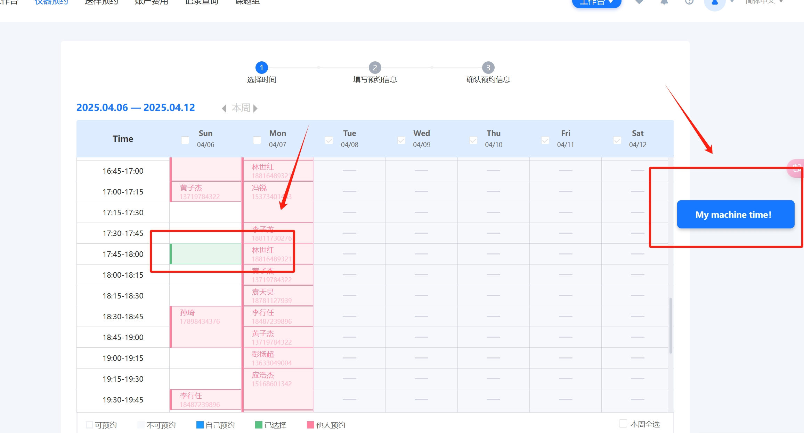
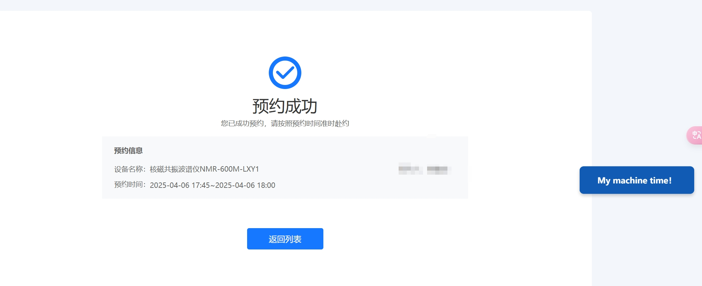

# Sustech_NMR

## Introduction

This Tampermonkey user script automates the NMR appointment process on the **Sustech** platform, specifically for the **BN预约平台**. After selecting your preferred time slot, simply click the "My Machine Time!" button, and the script will automatically handle the subsequent steps: agreeing to terms, clicking next, and submitting the appointment.

The goal is to streamline the appointment process and save time by automating repetitive tasks.

## Features

- **Automatic Flow**: 
  - Once a time slot is selected, clicking "My Machine Time!" will automatically handle the following:
    - Agreeing to terms and conditions.
    - Clicking through the steps of the booking process.
    - Submitting the appointment request.
  
## Installation

### Prerequisites

- **Scriptcat Extension**: 
  Ensure you have the [Scriptcat](https://scriptcat.org/zh-CN/) extension installed on your browser.

### Steps

1. Install Scriptcat.
2. Open [Search page](https://scriptcat.org/zh-CN/search).
3. Find Sustech NMR.
4. Download the script.

### Usage

- **Step 1**: Navigate to the [**Sustech NMR Appointment Page**](https://openlab.sustech.edu.cn/Console/Appointment/EquipmentList).
- **Step 2**: Select your desired time slot.
- **Step 3**: Click the **"My Machine Time!"** button (this will appear on the right side of your screen).
- **Step 4**: The script will automatically complete the booking process for you!

## Example Screenshot

  ###step1  
  
  
  
  
  
  
  

## License

This project is licensed under the MIT License - see the [LICENSE](LICENSE) file for details.
